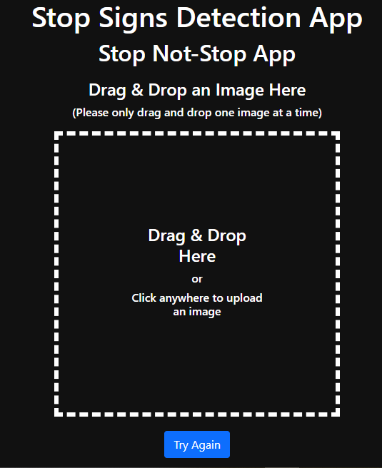
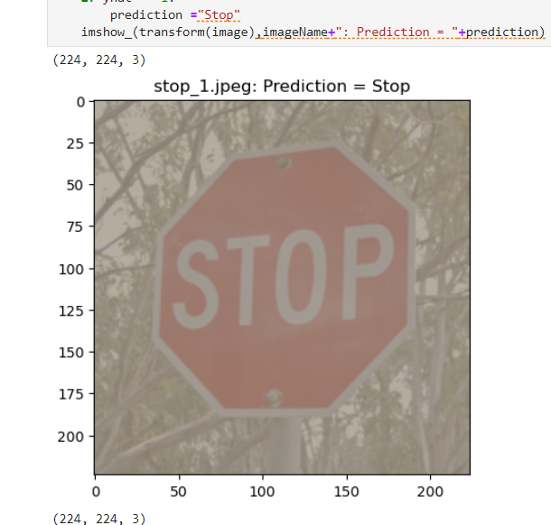
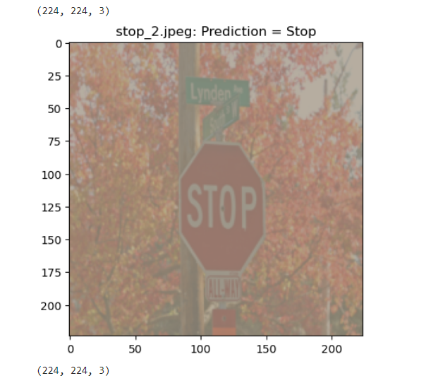
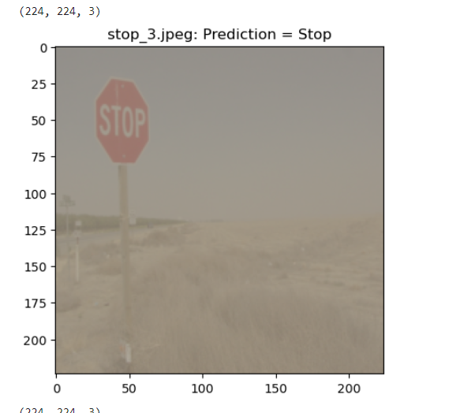
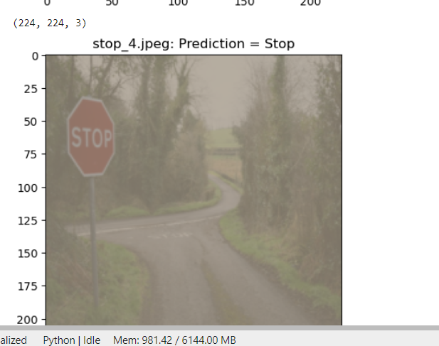
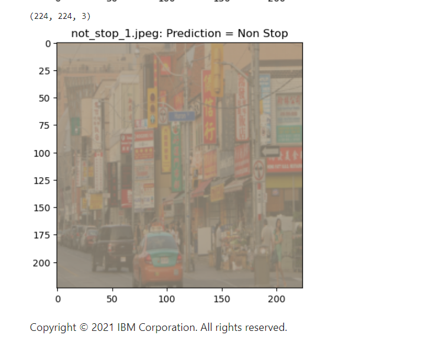
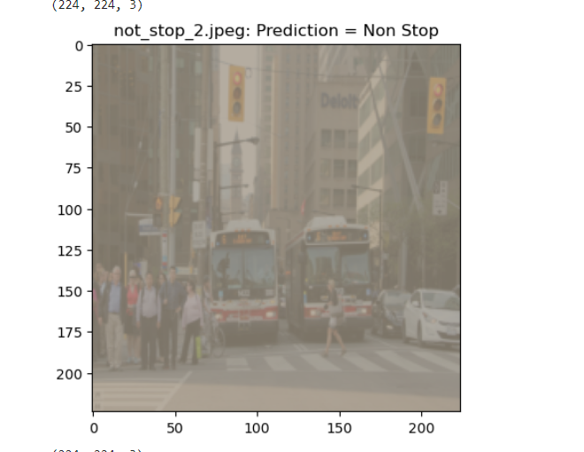
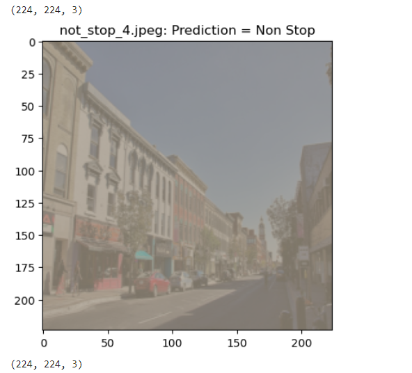
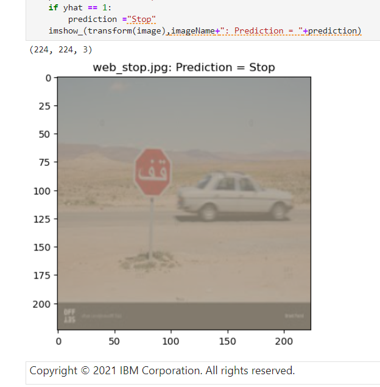

## Jokwu Stop Sign Classifier

## Project Overview 🚗
 Our goal is to develop a model that accurately identifies stop signs in images, a crucial step in creating a reliable self-driving car at Jokwu, a self-driving car start-up in Capetown, South Africa. .

 

## Project Tasks 📋
**Task 1**: Gather and Upload the  Data 📷
To kick off the project, I will collect and upload the necessary training images. This dataset forms the foundation for training the stop sign classifier.

**Task 2**: Train Our Classifier 🤖
The core of the project involves creating features and training the model to accurately identify stop signs in images. I'll leverage CV Studio for this crucial step.

**Task 3**: Deploy Our Model 🚀
Once the model is trained successfully, the next step is deployment to **Code Engine**. This will enable integration into a **web app** for further testing and implementation.

**Task 4**: Test Our Classifier 🧪
The final validation step involves testing the classifier. I'll upload an image of a stop sign, and the classifier will determine its accuracy in correctly identifying the stop sign.

The Prediction of stop_1.jpeg of test images

 

The Prediction of stop_2.jpeg of test images

 

The Prediction of stop_3.jpeg of test images

 

The Prediction of stop_4.jpeg of test images

 

The Prediction of not_stop_1.jpeg of test images

 

The Prediction of not_stop_2.jpeg of test images

 

The Prediction of not_stop_3.jpeg of test images

 

The Prediction of not_stop_4.jpeg of test images

 

image of a Moroccan imageg of a stop sign 

 

